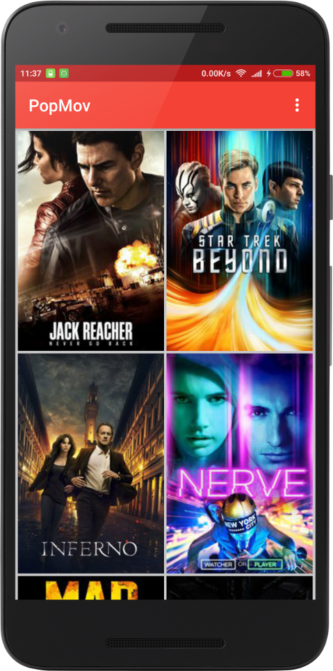
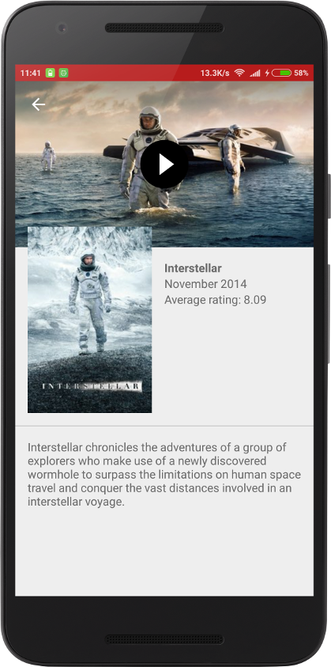

# PopularMovies

Android app that allows you to browse movies and their info provided by [The Movie Database](https://www.themoviedb.org/) API. Designed as a learning experiment to explore the basics of the Android platform.

## Features

- Browse the most popular or the most rated movies.
- Watch trailers.
- Read movies overviews.

**Responsive UI:** adapts from small phones to tablets.

**Widely compatible:** targets API 15, which means it's compatible with 97.4%* of the devices that are active on the Google Play Store. 

*_Figure provided by Android Studio as of time of development of this app._

## Screens

[[https://i.imgur.com/HakwuAd.jpg]]

## Libraries
- [Picasso](http://square.github.io/picasso/)
- [Retrofit 2](https://square.github.io/retrofit/)
- [Google-gson](https://github.com/google/gson)
- [AdjustableImageView](https://github.com/nuuneoi/AdjustableImageView)

## Inspired by

**Idea**: Popular Movies Android app from Udacity's [Developing Android Apps](https://www.udacity.com/course/developing-android-apps--ud853) course, part of  Google's Android Developer Nanodegree.

**UI/UX**: [Popular Movies by ewintory.](https://github.com/ewintory/udacity-popular-movies)
